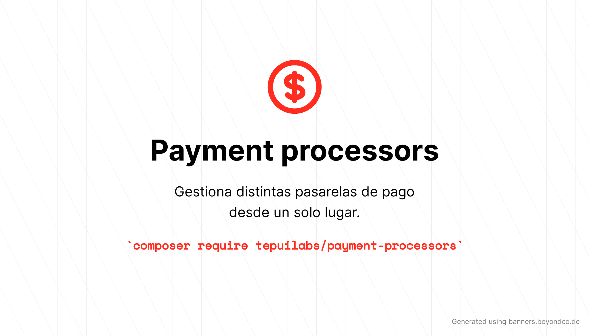

<p align="center">
	
</p>

# Payment processors

[](https://packagist.org/packages/tepuilabs/payment-processors)
[](https://github.com/tepuilabs/payment-processors/actions?query=workflow%3ATests+branch%3Amaster)
[](https://packagist.org/packages/tepuilabs/payment-processors)


Paquete para laravel que se encarga de gestionar diferentes pasarelas de pago:

- Mercadopago de Mercadolibre
- PayPal


Esto es idea original de @JuanDMeGon, tomada de su curso en Udemy de [Procesa pagos con Laravel y las mejores plataformas de pagos](https://www.udemy.com/course/procesa-pagos-en-linea-con-laravel-y-pasarelas-de-pagos-paypal-stripe/?referralCode=23F6FEDB611DEF416097).

Muchas gracias Juan por tu trabajo y esfuerzo!!


## instalación

usando composer

```bash
composer require tepuilabs/payment-processors
```

de forma opcional puedes publicar el archivo de configuración:

```bash
php artisan vendor:publish --provider="Tepuilabs\PaymentProcessors\PaymentProcessorsServiceProvider" --tag="config"
```

el contenido del archivo de configuración es el siguiente:

```php
<?php

return [

    'mercadopago' => [
        'class' => \Tepuilabs\PaymentProcessors\Services\MercadoPagoService::class,
    ],

    'paypal' => [
        'class' => \Tepuilabs\PaymentProcessors\Services\PayPalService::class,
    ],

    'stripe' => [
        'class' => \Tepuilabs\PaymentProcessors\Services\StripeService::class,
    ],

];
```

### como usar


<details>

<summary>Mercado pago</summary>

Primero debes seguir las indicaciones de mercado libre para hacer la integración de [cliente](https://www.mercadopago.com.uy/developers/es/guides/online-payments/checkout-api/receiving-payment-by-card/) luego de eso, sigue los pasos abajo descritos:

> NOTA: esta implementación no está pensada para cobros en cuotas

```php
// usa el facade
use Tepuilabs\PaymentProcessors\Facades\PaymentProcessors;

// luego crea la instancia de la clase a usar
$params = [
    'base_uri' => 'https://api.mercadopago.com',
    'key' => '',
    'secret' => '',
    'base_currency' => '',
];

$mercadopago = PaymentProcessors::resolveService('mercadopago', $params);

// necesitamos:
// $cardNetwork: visa / mastercard
// $cardToken: token de la tarjeta
// $amount: monto a cobrar
// $userEmail: correo del usuario

$mercadopago->handlePayment('visa', 'ff8080814c11e237014c1ff593b57b4d', 177, 'test@test.com');
```

### respuesta

```yml
{
    "status": "approved",
    "status_detail": "accredited",
    "id": 3055677,
    "date_approved": "2019-02-23T00:01:10.000-04:00",
    "payer": {
        ...
    },
    "payment_method_id": "visa",
    "payment_type_id": "credit_card",
    "refunds": [],
    ...
}
```
</details>

<details>
<summary>PayPal</summary>
Para usar paypal solamente debemos usar dos metodos:

```php
// usa el facade
use Tepuilabs\PaymentProcessors\Facades\PaymentProcessors;

// luego crea la instancia de la clase a usar

$params = [
    'base_uri' => 'https://api.sandbox.paypal.com',
    'client_id' => '',
    'client_secret' => '',
    'return_url' => '',
    'cancel_url' => ''
];

$paypal = PaymentProcessors::resolveService('paypal', $params);

// necesitamos:
// $amoun: el monto a cobrar
// $currency: el id de la moneda a cobrar, por defecto es USD

// este método hace una redirección a paypal

$paypal->handlePayment(200);

// el otro método que debemos usar es

$paypal->handleApproval();

// este método retorna toda la infromación del pago de ser aceptado por el usuario
// o retorna un array vacio

```

</details>

## Testing

```bash
composer test
```

## Changelog

Please see [CHANGELOG](CHANGELOG.md) for more information on what has changed recently.

## Contributing

Please see [CONTRIBUTING](.github/CONTRIBUTING.md) for details.


## Credits

- [angel cruz](https://github.com/abr4xas)
- [All Contributors](../../contributors)

## License

The MIT License (MIT). Please see [License File](LICENSE.md) for more information.
